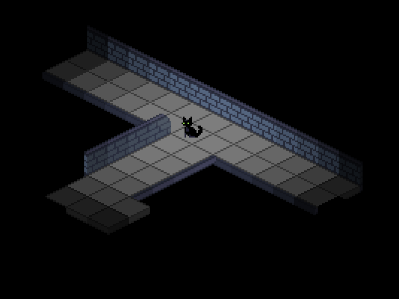

# Pipaluk

A game about a cat named Pipaluk trying to find a way out of a long dead city of hopeless robots.

<p float="left" align="middle">
  
  
  
</p>

Thread carefully along the streets of this strange city and delve deep into the underground corridors underneath it, while avoiding and running from the not-so-friendly residents.

<p float="left" align="middle">
  
  
</p>

## Build Pipaluk

In order to build the project, you will need to [install Rust and Cargo](https://doc.rust-lang.org/cargo/getting-started/installation.html) (both Linux and Windows).

### Linux (Ubuntu)

You will need SDL2:
```bash
sudo apt-get install libsdl2-dev libsdl2-mixer-dev libsdl2-image-dev libsdl2-ttf-dev
```

Clone the project and navigate to it via terminal:
```bash
git clone https://github.com/matf-pp/2023_Pipaluk.git
cd 2023_Pipaluk
```

The following command will install any required libraries, build, and finally run the game:
```bash
cargo run
```

## Credits

The game was developed with love by Marijana Čupović ([Marijameme](https://github.com/Marijameme)), Vuk Amidžić ([vukamidzic](https://github.com/vukamidzic)), and Daniil Grbić ([daniilgrbic](https://github.com/daniilgrbic)).

Big thanks to Lara Ritan for the awesome soundtrack.

Art by Daniil Grbić.